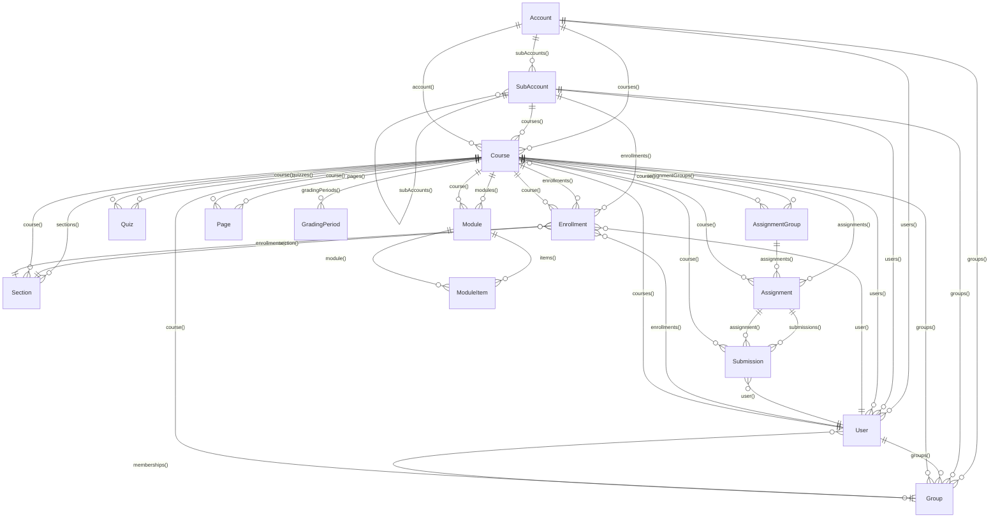
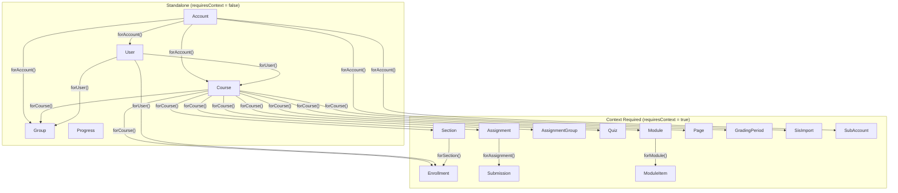
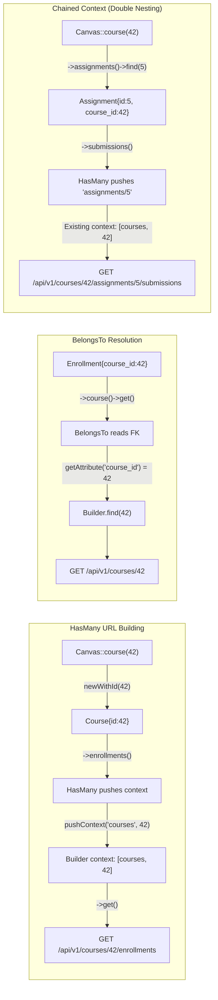

# Canvas LMS Package - Model Relationships

This document maps all relationships between models in the Canvas LMS Laravel package, aligned with the [Canvas REST API documentation](https://canvas.instructure.com/doc/api/).

All models extend `CanvasModel` — they are **API-backed**, not database-backed. Relationships resolve via HTTP calls to nested Canvas API endpoints, not database joins.

---

## How Relationships Work

| Type | Class | Direction | URL Strategy | Returns |
|------|-------|-----------|--------------|---------|
| **HasMany** | `Relations\HasMany` | Parent -> Children | Pushes parent endpoint + ID as URL context prefix | `PaginatedResponse` / `Collection` |
| **BelongsTo** | `Relations\BelongsTo` | Child -> Parent | Fetches parent at its own endpoint by foreign key value | Single `CanvasModel` or `null` |

**HasMany** builds nested URLs via context stack:
```php
$course->enrollments()->get();
// HasMany pushes: ['courses', 42]
// Builder builds: GET /api/v1/courses/42/enrollments
```

**BelongsTo** resolves via foreign key lookup:
```php
$enrollment->course()->get();
// BelongsTo reads: $enrollment->course_id (e.g. 42)
// Builder builds: GET /api/v1/courses/42
```

---

## Entity Relationship Diagram



---

## Context Dependency Diagram

Models marked `requiresContext = true` cannot be queried standalone — they need a parent pushed onto the Builder context stack.



---

## API URL Construction Flow



---

## Canvas API Resource Hierarchy

Resources marked `[*]` have a model in the package. Resources marked `[ ]` are not yet implemented.

```
Account [*]
  +-- SubAccount [*] (hierarchical, self-referencing)
  +-- EnrollmentTerm [ ]
  +-- GradingPeriodSet [ ]
  +-- Rubric [ ]
  +-- SisImport [*]
  +-- Course [*]
  |     +-- Enrollment [*] --> User [*], Section [*]
  |     +-- Section [*] --> Enrollment [*]
  |     +-- Assignment [*]
  |     |     +-- Submission [*] --> User [*], SubmissionComment [*]
  |     |     +-- AssignmentOverride [ ]
  |     |     +-- RubricAssociation [ ]
  |     +-- AssignmentGroup [*] --> Assignment [*]
  |     +-- Quiz [*]
  |     |     +-- QuizQuestion [ ]
  |     |     +-- QuizSubmission [ ]
  |     +-- Module [*]
  |     |     +-- ModuleItem [*]
  |     +-- Page [*]
  |     +-- Group [*]
  |     |     +-- GroupMembership [ ] --> User [*]
  |     +-- GroupCategory [ ] --> Group [*]
  |     +-- GradingPeriod [*]
  |     +-- DiscussionTopic [ ]
  |     |     +-- DiscussionEntry [ ]
  |     +-- File [ ]
  |     +-- Folder [ ]
  +-- User [*]
  |     +-- Enrollment [*]
  |     +-- Course [*]
  |     +-- Group [*]
  +-- Group [*]
  +-- Progress [*]
```

---

## Per-Model Relationship Tables

### Account

`src/Models/Account.php` | `endpoint = 'accounts'` | `requiresContext = false`

| Relationship | Type | Related Model | Key / Context | Canvas API Endpoint |
|---|---|---|---|---|
| `courses()` | HasMany | Course | context: `accounts/:id` | `GET /api/v1/accounts/:id/courses` |
| `users()` | HasMany | User | context: `accounts/:id` | `GET /api/v1/accounts/:id/users` |
| `groups()` | HasMany | Group | context: `accounts/:id` | `GET /api/v1/accounts/:id/groups` |
| `subAccounts()` | HasMany | SubAccount | context: `accounts/:id` | `GET /api/v1/accounts/:id/sub_accounts` |

---

### User

`src/Models/User.php` | `endpoint = 'users'` | `requiresContext = false`

| Relationship | Type | Related Model | Key / Context | Canvas API Endpoint |
|---|---|---|---|---|
| `enrollments()` | HasMany | Enrollment | context: `users/:id` | `GET /api/v1/users/:id/enrollments` |
| `courses()` | HasMany | Course | context: `users/:id` | `GET /api/v1/users/:id/courses` |
| `groups()` | HasMany | Group | context: `users/:id` | `GET /api/v1/users/:id/groups` |

**Action methods:** `suspend()`, `unsuspend()`

---

### Course

`src/Models/Course.php` | `endpoint = 'courses'` | `requiresContext = false`

| Relationship | Type | Related Model | Key / Context | Canvas API Endpoint |
|---|---|---|---|---|
| `enrollments()` | HasMany | Enrollment | context: `courses/:id` | `GET /api/v1/courses/:id/enrollments` |
| `sections()` | HasMany | Section | context: `courses/:id` | `GET /api/v1/courses/:id/sections` |
| `assignments()` | HasMany | Assignment | context: `courses/:id` | `GET /api/v1/courses/:id/assignments` |
| `assignmentGroups()` | HasMany | AssignmentGroup | context: `courses/:id` | `GET /api/v1/courses/:id/assignment_groups` |
| `quizzes()` | HasMany | Quiz | context: `courses/:id` | `GET /api/v1/courses/:id/quizzes` |
| `modules()` | HasMany | Module | context: `courses/:id` | `GET /api/v1/courses/:id/modules` |
| `pages()` | HasMany | Page | context: `courses/:id` | `GET /api/v1/courses/:id/pages` |
| `groups()` | HasMany | Group | context: `courses/:id` | `GET /api/v1/courses/:id/groups` |
| `users()` | HasMany | User | context: `courses/:id` | `GET /api/v1/courses/:id/users` |
| `gradingPeriods()` | HasMany | GradingPeriod | context: `courses/:id` | `GET /api/v1/courses/:id/grading_periods` |
| `account()` | BelongsTo | Account | FK: `account_id` | `GET /api/v1/accounts/:account_id` |

**Action methods:** `publish()`, `hide()`, `conclude()`, `restore()`

---

### Section

`src/Models/Section.php` | `endpoint = 'sections'` | `requiresContext = true`

| Relationship | Type | Related Model | Key / Context | Canvas API Endpoint |
|---|---|---|---|---|
| `course()` | BelongsTo | Course | FK: `course_id` | `GET /api/v1/courses/:course_id` |
| `enrollments()` | HasMany | Enrollment | context: `sections/:id` | `GET /api/v1/sections/:id/enrollments` |

---

### Enrollment

`src/Models/Enrollment.php` | `endpoint = 'enrollments'` | `requiresContext = true`

| Relationship | Type | Related Model | Key / Context | Canvas API Endpoint |
|---|---|---|---|---|
| `user()` | BelongsTo | User | FK: `user_id` | `GET /api/v1/users/:user_id` |
| `course()` | BelongsTo | Course | FK: `course_id` | `GET /api/v1/courses/:course_id` |
| `section()` | BelongsTo | Section | FK: `course_section_id` | `GET /api/v1/sections/:course_section_id` |

**Action methods:** `conclude()`, `deactivate()`, `reactivate()`, `delete()`

---

### Assignment

`src/Models/Assignment.php` | `endpoint = 'assignments'` | `requiresContext = true`

| Relationship | Type | Related Model | Key / Context | Canvas API Endpoint |
|---|---|---|---|---|
| `course()` | BelongsTo | Course | FK: `course_id` | `GET /api/v1/courses/:course_id` |
| `submissions()` | HasMany | Submission | context: `assignments/:id` | `GET /api/v1/courses/:cid/assignments/:id/submissions` |

> **Note:** `submissions()` pushes only `assignments/:id` as context. The `courses/:cid` segment must already be in the builder's context stack. This works when traversing from a course (e.g., `$course->assignments()->find(5)`) but not from a standalone `Assignment::newWithId(5)`.

**Action methods:** `bulkGrade(array $grades)` -> returns `Progress`

---

### AssignmentGroup

`src/Models/AssignmentGroup.php` | `endpoint = 'assignment_groups'` | `requiresContext = true`

| Relationship | Type | Related Model | Key / Context | Canvas API Endpoint |
|---|---|---|---|---|
| `course()` | BelongsTo | Course | FK: `course_id` | `GET /api/v1/courses/:course_id` |
| `assignments()` | HasMany | Assignment | context: `assignment_groups/:id` | **Invalid** - see RepairRelationships.md |

> **Warning:** `assignments()` produces `GET /api/v1/assignment_groups/:id/assignments` which does not exist in the Canvas API.

---

### Submission

`src/Models/Submission.php` | `endpoint = 'submissions'` | `requiresContext = true`

| Relationship | Type | Related Model | Key / Context | Canvas API Endpoint |
|---|---|---|---|---|
| `assignment()` | BelongsTo | Assignment | FK: `assignment_id` | **Broken** - Assignment requires context |
| `user()` | BelongsTo | User | FK: `user_id` | `GET /api/v1/users/:user_id` |
| `course()` | BelongsTo | Course | FK: `course_id` | `GET /api/v1/courses/:course_id` |

> **Warning:** `assignment()` will fail because Assignment has `requiresContext = true` and BelongsTo fetches at the top-level endpoint. Canvas does not support `GET /api/v1/assignments/:id`.

**Action methods:** `grade()`, `excuse()`, `addComment()`, `gradeWithRubric()`

---

### SubmissionComment

`src/Models/SubmissionComment.php` | `endpoint = ''` | `requiresContext = false`

No relationships. This is an **embedded resource** — returned as nested JSON within submission responses when using `include[]=submission_comments`. It is not queryable via the Builder.

---

### Quiz

`src/Models/Quiz.php` | `endpoint = 'quizzes'` | `requiresContext = true`

| Relationship | Type | Related Model | Key / Context | Canvas API Endpoint |
|---|---|---|---|---|
| `course()` | BelongsTo | Course | FK: `course_id` | `GET /api/v1/courses/:course_id` |

---

### Module

`src/Models/Module.php` | `endpoint = 'modules'` | `requiresContext = true`

| Relationship | Type | Related Model | Key / Context | Canvas API Endpoint |
|---|---|---|---|---|
| `course()` | BelongsTo | Course | FK: `course_id` | `GET /api/v1/courses/:course_id` |
| `items()` | HasMany | ModuleItem | context: `modules/:id` | `GET /api/v1/courses/:cid/modules/:id/items` |

---

### ModuleItem

`src/Models/ModuleItem.php` | `endpoint = 'items'` | `requiresContext = true`

| Relationship | Type | Related Model | Key / Context | Canvas API Endpoint |
|---|---|---|---|---|
| `module()` | BelongsTo | Module | FK: `module_id` | **Broken** - Module requires context |

> **Warning:** `module()` will fail because Module has `requiresContext = true` and BelongsTo fetches at the top-level endpoint. Canvas does not support `GET /api/v1/modules/:id`.

---

### Page

`src/Models/Page.php` | `endpoint = 'pages'` | `requiresContext = true`

| Relationship | Type | Related Model | Key / Context | Canvas API Endpoint |
|---|---|---|---|---|
| `course()` | BelongsTo | Course | FK: `course_id` | `GET /api/v1/courses/:course_id` |

> **Note:** Page uses `page_id` / `url` as its identifier instead of `id`. The `getAttribute` method maps `id` to `page_id` or `url`.

---

### Group

`src/Models/Group.php` | `endpoint = 'groups'` | `requiresContext = false`

| Relationship | Type | Related Model | Key / Context | Canvas API Endpoint |
|---|---|---|---|---|
| `course()` | BelongsTo | Course | FK: `course_id` | `GET /api/v1/courses/:course_id` |
| `memberships()` | HasMany | User | context: `groups/:id` | `GET /api/v1/groups/:id/users` |

> **Warning:** `memberships()` returns User objects, not GroupMembership objects. The method name is misleading. See RepairRelationships.md.

---

### GradingPeriod

`src/Models/GradingPeriod.php` | `endpoint = 'grading_periods'` | `requiresContext = true`

No relationships defined.

**Helper methods:** `isOpen()`, `isClosed()`

---

### Progress

`src/Models/Progress.php` | `endpoint = 'progress'` | `requiresContext = false`

No relationships. Standalone polling resource for async operations.

**Helper methods:** `isComplete()`, `isFailed()`, `isPending()`, `refresh()`, `wait()`

---

### SisImport

`src/Models/SisImport.php` | `endpoint = 'sis_imports'` | `requiresContext = true`

No relationships. Contains its own refresh/wait polling logic with a stored `accountId`.

**Helper methods:** `isComplete()`, `isFailed()`, `isPending()`, `hasErrors()`, `hasWarnings()`, `errors()`, `warnings()`, `refresh()`, `wait()`

---

### SubAccount

`src/Models/SubAccount.php` | `endpoint = 'sub_accounts'` | `requiresContext = true`

| Relationship | Type | Related Model | Key / Context | Canvas API Endpoint |
|---|---|---|---|---|
| `courses()` | HasMany | Course | context: `accounts/:id` | `GET /api/v1/accounts/:id/courses` |
| `users()` | HasMany | User | context: `accounts/:id` | `GET /api/v1/accounts/:id/users` |
| `enrollments()` | HasMany | Enrollment | context: `accounts/:id` | `GET /api/v1/accounts/:id/enrollments` |
| `groups()` | HasMany | Group | context: `accounts/:id` | `GET /api/v1/accounts/:id/groups` |
| `subAccounts()` | HasMany | SubAccount | context: `accounts/:id` | `GET /api/v1/accounts/:id/sub_accounts` |

> **Note:** SubAccount overrides `getRelationshipEndpoint()` to return `'accounts'` so that child relationships route through `accounts/:id/...` rather than `sub_accounts/:id/...`. This is correct — Canvas treats subaccounts as accounts in URL space.

---

## Relationship Statistics

| Metric | Count |
|---|---|
| Total models | 19 |
| Models with HasMany | 9 (Account, User, Course, Section, Assignment, AssignmentGroup, Module, Group, SubAccount) |
| Models with BelongsTo | 10 (Course, Section, Enrollment, Assignment, AssignmentGroup, Submission, Quiz, Module, ModuleItem, Page, Group) |
| Models with no relationships | 4 (SubmissionComment, GradingPeriod, Progress, SisImport) |
| Total HasMany relationships | 27 |
| Total BelongsTo relationships | 12 |
| **Total relationships** | **39** |

---

## Facade Entry Points

The `Canvas` facade (`src/Canvas.php`) provides two patterns for accessing models:

### Query Builders (for listing/searching)

```php
Canvas::accounts()          // Builder for Account
Canvas::users()             // Builder for User
Canvas::courses()           // Builder for Course
Canvas::groups()            // Builder for Group
Canvas::enrollments()       // Builder for Enrollment
Canvas::accountCourses()    // Builder for Course scoped to config account
Canvas::accountUsers()      // Builder for User scoped to config account
Canvas::accountGroups()     // Builder for Group scoped to config account
Canvas::subAccountCourses($id)  // Builder for Course scoped to subaccount
```

### Lazy Model Factories (for relationship traversal)

```php
Canvas::account($id)     // Account with only id set (no API call)
Canvas::user($id)        // User with only id set
Canvas::course($id)      // Course with only id set
Canvas::group($id)       // Group with only id set
Canvas::section($id)     // Section with only id set
Canvas::assignment($id)  // Assignment with only id set
Canvas::quiz($id)        // Quiz with only id set
Canvas::module($id)      // Module with only id set
Canvas::page($id)        // Page with only id set
Canvas::submission($id)  // Submission with only id set
```

### Builder Context Methods

```php
->forAccount($id)      // Push accounts/:id context
->forCourse($id)       // Push courses/:id context
->forUser($id)         // Push users/:id context
->forSection($id)      // Push sections/:id context
->forGroup($id)        // Push groups/:id context
->forAssignment($id)   // Push assignments/:id context
->forModule($id)       // Push modules/:id context
->forSubAccount($id)   // Push accounts/:id context
```
